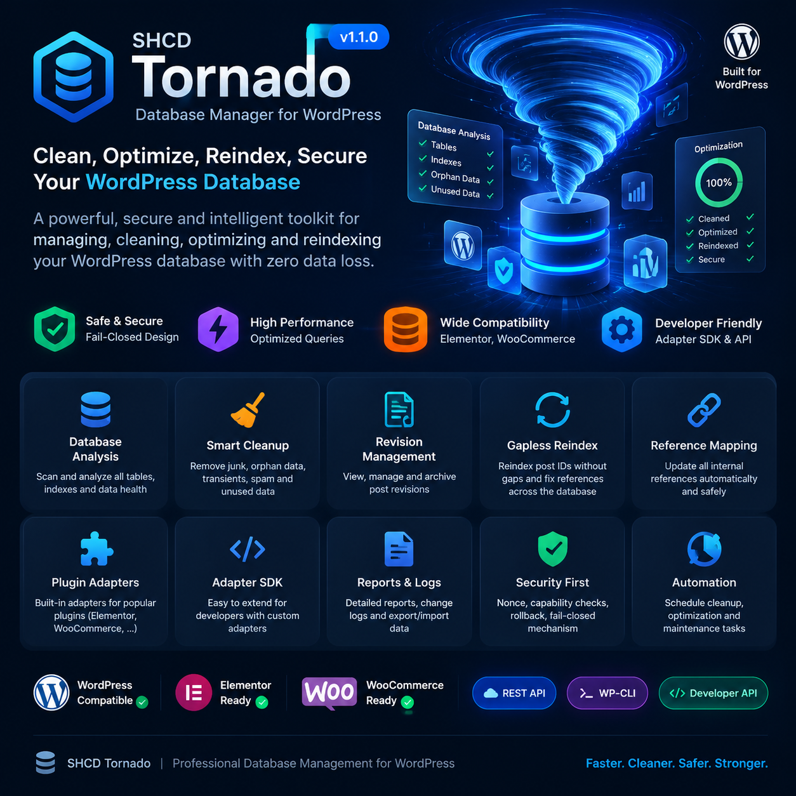

# 🌪️ SHCD Tornado



**Professional WordPress Database Management, Optimization, Cleanup &
Secure Reindex Framework**


------------------------------------------------------------------------

## 🌐 Documentation

-   🇬🇧 English
-   🇸🇦 العربية
-   🇮🇷 فارسی

------------------------------------------------------------------------

# 🇬🇧 English

## Overview

SHCD Tornado is an advanced WordPress database maintenance framework
built for developers, agencies, and professional website administrators.

It provides a secure workflow for database inspection, optimization,
cleanup, backup preparation, reference mapping, and controlled Post ID
reindexing.

Tornado is designed around safety-first principles, preventing unsafe
transformations and protecting WordPress data integrity.

------------------------------------------------------------------------

## Core Features

### 🔍 Database Analysis Engine

-   Automatic WordPress table discovery
-   Dynamic database prefix detection
-   Database structure inspection
-   Integrity validation
-   Table and index analysis
-   Operational reports

### 💾 Backup & Safety Workflow

-   Backup-first maintenance approach
-   Pre-operation verification
-   Safe preparation before destructive actions
-   Validation before commit

### 🧹 Database Cleanup System

-   Revision cleanup
-   Metadata cleanup
-   Unused data detection
-   Safe cleanup operations
-   Cleanup reports

### 🔄 Gapless Post ID Reindex Engine

Advanced controlled reindexing system:

-   Old ID mapping
-   Temporary ID generation
-   New ID assignment
-   Collision prevention
-   Reference synchronization
-   AUTO_INCREMENT repair
-   Rollback protection

### 🔗 Reference Mapping Engine

Handles internal WordPress relationships:

-   Post references
-   Metadata references
-   Structured data scanning
-   Scalar value transformation
-   Relationship validation

### 🧩 Plugin Compatibility

Designed for extension:

-   Plugin adapters
-   Custom mapping providers
-   Developer SDK
-   Elementor compatibility
-   WooCommerce compatibility

### 🏗️ Developer Architecture

Built with modular architecture:

-   Admin interface
-   Application services
-   Domain logic
-   Database infrastructure
-   REST API layer
-   WP-CLI compatibility

### 🛡️ Security Model

Security-focused operations:

-   Capability checks
-   Nonce validation
-   Fail-closed execution
-   Unsafe operation blocking
-   Verification before changes

------------------------------------------------------------------------

# 🆚 Free / Trial vs Pro

  Feature               Free / Trial   Pro
  --------------------- -------------- --------------
  Database Analysis     ✅ Basic       🚀 Advanced
  Backup Workflow       ✅             🚀 Advanced
  Cleanup Tools         Basic          Advanced
  Revision Management   ✅             ✅
  Reference Mapping     Limited        Full
  Post ID Reindex       Limited        Full
  Plugin Adapters       Basic          Extended SDK
  Reports               Basic          Advanced
  Automation            ❌             ✅
  Developer Tools       Limited        Full

------------------------------------------------------------------------

# 🇸🇦 العربية

::: {dir="rtl"}
## نظرة عامة

SHCD Tornado إضافة احترافية لصيانة قواعد بيانات WordPress تم تطويرها
للمطورين ومديري المواقع المتقدمة.

توفر الإضافة نظاماً آمناً لتحليل قاعدة البيانات وتنظيفها وتحسينها وإعادة
فهرسة معرفات المنشورات بطريقة محكومة.

## المميزات الرئيسية

### تحليل قاعدة البيانات

-   اكتشاف الجداول تلقائياً
-   تحليل البنية
-   فحص سلامة البيانات
-   التقارير التشغيلية

### النسخ الاحتياطي والأمان

-   منهج النسخ الاحتياطي أولاً
-   التحقق قبل التعديل
-   حماية العمليات الحساسة

### تنظيف قاعدة البيانات

-   تنظيف المراجعات
-   إزالة البيانات غير المستخدمة
-   تقارير التنظيف

### إعادة فهرسة Post ID

-   إنشاء خرائط معرفات آمنة
-   منع التعارض
-   تحديث العلاقات
-   إصلاح AUTO_INCREMENT

### إدارة المراجع

-   تحليل العلاقات الداخلية
-   تحويل البيانات المرتبطة
-   دعم الإضافات

### للمطورين

-   REST API
-   WP-CLI
-   بنية قابلة للتوسع
-   SDK للمطورين
:::

------------------------------------------------------------------------

# 🇮🇷 فارسی

::: {dir="rtl"}
## معرفی

SHCD Tornado یک فریم‌ورک حرفه‌ای مدیریت و نگهداری دیتابیس وردپرس است که
برای توسعه‌دهندگان، آژانس‌ها و مدیران سایت‌های حرفه‌ای طراحی شده است.

این افزونه با تمرکز بر امنیت، عملیات تحلیل، پاکسازی، بکاپ، مدیریت
ارتباطات و بازشماری کنترل‌شده شناسه‌ها را انجام می‌دهد.

## قابلیت‌های اصلی

### تحلیل دیتابیس

-   تشخیص خودکار جداول وردپرس
-   تشخیص Prefix دیتابیس
-   بررسی ساختار اطلاعات
-   بررسی سلامت داده‌ها
-   گزارش‌گیری

### سیستم بکاپ و امنیت

-   فرآیند Backup First
-   اعتبارسنجی قبل از تغییر
-   جلوگیری از عملیات خطرناک

### پاکسازی دیتابیس

-   پاکسازی Revision ها
-   حذف داده‌های بلااستفاده
-   بررسی Metadata
-   گزارش عملیات

### موتور Reindex پیشرفته

-   Mapping شناسه‌های قدیمی
-   ایجاد شناسه موقت
-   تولید شناسه جدید
-   جلوگیری از Collision
-   اصلاح AUTO_INCREMENT
-   امکان Rollback

### مدیریت Reference

-   شناسایی ارتباطات داخلی
-   تبدیل مقادیر مرتبط
-   پشتیبانی از ساختارهای پیچیده

### معماری توسعه‌دهنده

-   REST API
-   WP-CLI
-   Adapter SDK
-   ساختار ماژولار
:::

------------------------------------------------------------------------

# 📸 Screenshots

Add screenshots here:

``` text
assets/screenshots/
├── dashboard.png
├── analyzer.png
├── cleanup.png
├── reindex.png
└── reports.png
```

------------------------------------------------------------------------

# 🚀 Installation

1.  Upload plugin files.
2.  Activate SHCD Tornado.
3.  Create a verified backup.
4.  Run database analysis.
5.  Execute maintenance operations.

------------------------------------------------------------------------

# 📝 Changelog

## Version 1.0.0

-   Initial release
-   Database analysis engine
-   Cleanup framework
-   Backup workflow
-   Reference mapping
-   Safe reindex engine

------------------------------------------------------------------------

# 📄 License

GPL-2.0-or-later

------------------------------------------------------------------------

# 👨‍💻 Developer

Developed by <a href="https://shabnam.dev"> SHABNAM.DEV </a>
