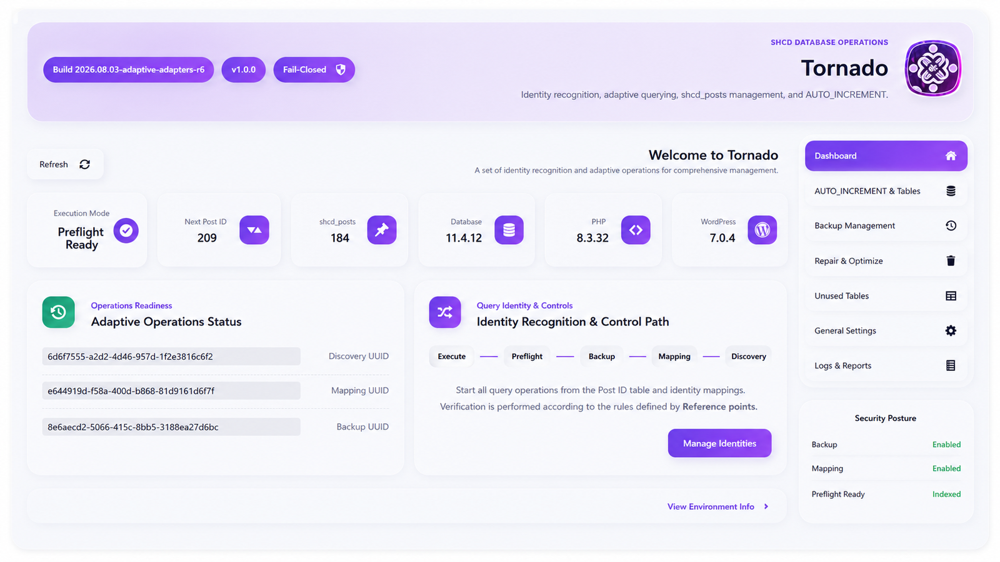

# 🌪️ SHCD Tornado

**Advanced WordPress Database Integrity, Cleanup, Backup & Secure
Reindex Framework**

------------------------------------------------------------------------

## 🌐 Documentation

-   🇬🇧 [English](#-english)
-   🇸🇦 [العربية](#-العربية)
-   🇮🇷 [فارسی](#-فارسی)

------------------------------------------------------------------------

# 🇬🇧 English

## Overview

SHCD Tornado is a professional WordPress database maintenance framework
designed for developers, agencies, and advanced website administrators.

It provides secure tools for database discovery, integrity analysis,
backup workflows, cleanup operations, reference mapping, controlled Post
ID reindexing, plugin compatibility, reporting, and developer
integrations.

Tornado follows a safety-first philosophy by validating operations
before applying changes and preventing unsafe transformations.

## 🔍 Database Analysis Engine

-   Automatic WordPress table discovery
-   Dynamic database prefix detection
-   Database structure inspection
-   Integrity validation
-   Table and index analysis
-   Operational reports

## 💾 Backup & Safety Workflow

-   Backup-first maintenance approach
-   Pre-operation verification
-   Safe preparation before destructive actions
-   Validation before commit

## 🧹 Database Cleanup System

-   Revision cleanup
-   Metadata cleanup
-   Unused data detection
-   Safe cleanup operations
-   Cleanup reports

## 🔄 Gapless Post ID Reindex Engine

Advanced controlled reindexing system:

-   Old ID mapping
-   Temporary ID generation
-   New ID assignment
-   Collision prevention
-   Reference synchronization
-   AUTO_INCREMENT repair
-   Rollback protection

## 🔗 Reference Mapping Engine

-   Post references
-   Metadata references
-   Structured data scanning
-   Scalar value transformation
-   Relationship validation

## 🧩 Plugin Compatibility

-   Plugin adapters
-   Custom mapping providers
-   Developer SDK
-   Elementor compatibility
-   WooCommerce compatibility

## 🏗️ Developer Architecture

-   Admin interface
-   Application services
-   Domain logic
-   Database infrastructure
-   REST API layer
-   WP-CLI compatibility

## 🛡️ Security Model

-   Capability checks
-   Nonce validation
-   Fail-closed execution
-   Unsafe operation blocking
-   Verification before changes

------------------------------------------------------------------------

# 🆚 Free / Trial vs Pro Comparison

  Feature               Free / Trial   Pro
  --------------------- -------------- --------------
  Database Analysis     ✅ Basic       🚀 Advanced
  Backup Workflow       ✅             🚀 Advanced
  Cleanup System        Basic          Advanced
  Revision Management   ✅             ✅
  Reference Mapping     Limited        Full
  Post ID Reindex       Limited        Full
  Plugin Adapters       Basic          Extended SDK
  Reports               Basic          Advanced
  Automation            ❌             ✅
  Developer Tools       Limited        Full

------------------------------------------------------------------------

# 🇸🇦 العربية

::: {dir="rtl"}
## نظرة عامة

SHCD Tornado إضافة احترافية لصيانة قواعد بيانات WordPress تم تطويرها
للمطورين والشركات ومديري المواقع المتقدمة.

توفر الإضافة أدوات آمنة لتحليل قاعدة البيانات، النسخ الاحتياطي، التنظيف،
إدارة العلاقات الداخلية، وإعادة فهرسة معرفات المنشورات بطريقة محكومة.

## 🔍 محرك تحليل قاعدة البيانات

-   اكتشاف جداول WordPress تلقائياً
-   اكتشاف بادئة قاعدة البيانات
-   فحص بنية البيانات
-   التحقق من سلامة المعلومات
-   تحليل الجداول والفهارس
-   التقارير التشغيلية

## 💾 النسخ الاحتياطي ونظام الأمان

-   منهج النسخ الاحتياطي أولاً
-   التحقق قبل العمليات
-   تجهيز آمن قبل التغييرات الحساسة
-   التحقق قبل الحفظ النهائي

## 🧹 نظام تنظيف قاعدة البيانات

-   تنظيف Revisions
-   تنظيف Metadata
-   اكتشاف البيانات غير المستخدمة
-   عمليات تنظيف آمنة
-   تقارير التنظيف

## 🔄 محرك إعادة فهرسة Post ID

-   خرائط المعرفات القديمة
-   إنشاء معرفات مؤقتة
-   منع التعارض
-   مزامنة المراجع
-   إصلاح AUTO_INCREMENT
-   حماية التراجع

## 🔗 محرك إدارة المراجع

-   مراجع المنشورات
-   مراجع البيانات الوصفية
-   فحص البيانات المنظمة
-   تحويل القيم
-   التحقق من العلاقات

## 🧩 توافق الإضافات

-   Plugin Adapters
-   Custom Mapping Providers
-   SDK للمطورين
-   دعم Elementor
-   دعم WooCommerce

## 🏗️ بنية المطورين

-   واجهة الإدارة
-   خدمات التطبيق
-   منطق النظام
-   طبقة قاعدة البيانات
-   REST API
-   WP-CLI

## 🛡️ نموذج الأمان

-   فحص الصلاحيات
-   التحقق من Nonce
-   تنفيذ Fail-Closed
-   منع العمليات الخطرة
-   التحقق قبل التعديل
:::

------------------------------------------------------------------------

# 🆚 مقارنة Free / Trial و Pro

  الميزة                 Free / Trial   Pro
  ---------------------- -------------- -------
  تحليل قاعدة البيانات   أساسي          متقدم
  النسخ الاحتياطي        ✅             متقدم
  التنظيف                أساسي          متقدم
  Reference Mapping      محدود          كامل
  Post ID Reindex        محدود          كامل
  SDK للمطورين           محدود          كامل
  التقارير               أساسي          متقدم

------------------------------------------------------------------------

# 🇮🇷 فارسی

::: {dir="rtl"}
## معرفی

SHCD Tornado یک فریم‌ورک حرفه‌ای نگهداری دیتابیس وردپرس برای توسعه‌دهندگان،
آژانس‌ها و مدیران سایت‌های حرفه‌ای است.

این افزونه با تمرکز بر امنیت، تحلیل دیتابیس، بکاپ، پاکسازی، مدیریت
ارتباطات داخلی و بازشماری کنترل‌شده Post ID طراحی شده است.

## 🔍 موتور تحلیل دیتابیس

-   شناسایی خودکار جداول وردپرس
-   تشخیص Prefix دیتابیس
-   بررسی ساختار دیتابیس
-   اعتبارسنجی سلامت داده‌ها
-   تحلیل جدول‌ها و Index ها
-   گزارش‌های عملیاتی

## 💾 سیستم بکاپ و ایمنی عملیات

-   رویکرد Backup First
-   بررسی قبل از عملیات
-   آماده‌سازی امن تغییرات
-   اعتبارسنجی قبل از Commit

## 🧹 سیستم پاکسازی دیتابیس

-   پاکسازی Revision ها
-   پاکسازی Metadata
-   شناسایی داده‌های بلااستفاده
-   عملیات پاکسازی امن
-   گزارش نتیجه عملیات

## 🔄 موتور Reindex بدون فاصله Post ID

-   Mapping شناسه‌های قدیمی
-   ایجاد شناسه موقت
-   تولید شناسه جدید
-   جلوگیری از Collision
-   هماهنگ‌سازی Reference ها
-   اصلاح AUTO_INCREMENT
-   محافظت Rollback

## 🔗 موتور مدیریت Reference

-   Reference نوشته‌ها
-   Reference متادیتا
-   اسکن داده‌های ساختاریافته
-   تبدیل مقادیر Scalar
-   اعتبارسنجی ارتباطات

## 🧩 سازگاری افزونه‌ها

-   Plugin Adapter
-   Mapping Provider سفارشی
-   SDK توسعه‌دهندگان
-   سازگاری Elementor
-   سازگاری WooCommerce

## 🏗️ معماری توسعه‌دهنده

-   رابط مدیریت
-   Application Services
-   Domain Logic
-   زیرساخت دیتابیس
-   REST API
-   WP-CLI

## 🛡️ مدل امنیتی

-   بررسی دسترسی‌ها
-   اعتبارسنجی Nonce
-   اجرای Fail-Closed
-   جلوگیری از عملیات خطرناک
-   بررسی قبل از تغییر
:::

------------------------------------------------------------------------

# 🆚 مقایسه نسخه Free / Trial و Pro

  قابلیت              Free / Trial   Pro
  ------------------- -------------- ---------
  تحلیل دیتابیس       پایه           پیشرفته
  سیستم بکاپ          ✅             پیشرفته
  پاکسازی             پایه           پیشرفته
  Reference Mapping   محدود          کامل
  Post ID Reindex     محدود          کامل
  Adapter SDK         محدود          کامل
  گزارش‌ها             پایه           پیشرفته
  Automation          ❌             ✅

------------------------------------------------------------------------

# 📸 Screenshots

------------------------------------------------------------------------

# 👨‍💻 Developer

Developed by [SHABNAM.DEV](https://shabnam.dev/)
